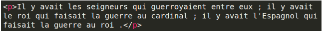
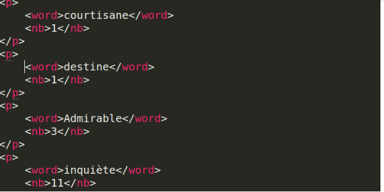
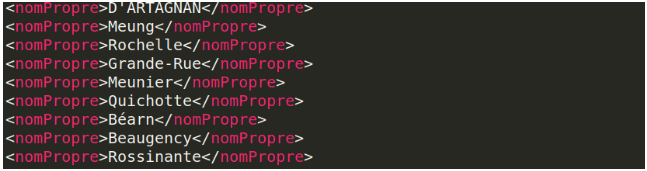
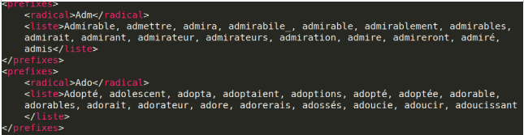
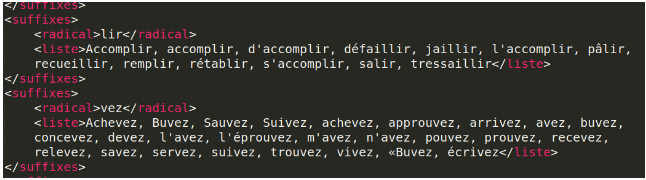
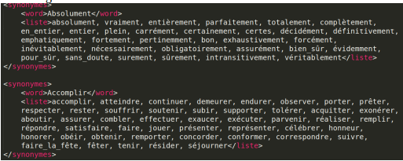
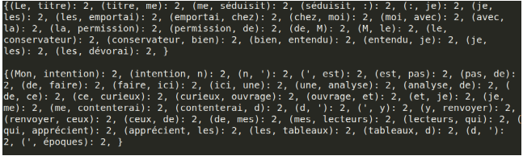
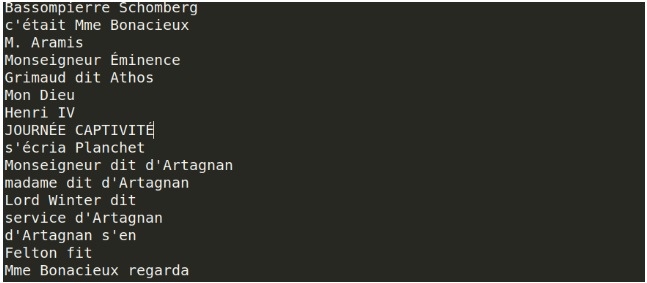

# Text Mining
---

|               Fodé HISSIROU               |
---

##  Objectif

L’objectif de ce projet consiste à connaître l’architecture de base des systèmes
du traitement automatique du langage naturel de manière à pouvoir concevoir un 
système selon les besoins spécifiques. Il consiste également de découvrir certain
outils linguistiques comme Natural Language Toolkit qui est basé sur python et 
d’appliquer des différentes méthodes de fouilles de données a des données textuelles.

## 1. Introduction

Ce programme est composé de plusieurs fonctionnalités différentes comme la séparation du corpus
en phrases, la suppression des stopword, l’occurrence des mots, la détection des noms propres, le
préfixe d’un mots, le suffixe d’un mots et les synonymes d’un mot. L’ensemble des scripts se trouve
dans le repertoire src et est repartie sur plusieurs fichiers différents.

#### Pour lancer le programme par exemple:
    - Stopword : python3 main.py -t Stopword -f ../input/data_no_stop.txt
    - Phrase : python3 main.py -t Stopword -f ../input/data_no_stop.txt
    - Nompropre : python3 main.py -t Nompropre -f ../input/data_no_stop.txt
    - Countword : python3 main.py -t Countword -f ../input/data_no_stop.txt
    - Préfixe : python3 main.py -t Préfixe -f ../input/data_no_stop.txt
    - Suffixe : python3 main.py -t Suffixe -f ../input/data_no_stop.txt
    - Synonyme :python3 main.py -t Synonyme -f ../input/data_no_stop.txt
    - Ngram : python3 main.py -t Ngram -f ../input/data_no_stop.txt
    - Entité nommées : python3 main.py -t NameEntity -f ../input/data_no_stop.txt

## 2. La séparation du corpus en Phrase

La fonction SeparateSentences() permet de faire une séparation du corpus en phrase. Pour cela on
lui donne deux fichiers en paramètre : le premier est le nom du fichier du corpus d’entrée et le
second est le fichier de sauvegarde. Elle utilise principalement la fonction sent_tokenize() de la
librarie nltk pour faire une séparation du texte en une liste de phrase. À l'aide d’une boucle je
parcours chaque élément de la liste pour ajouter le balise 
 au début de la phrase et 
 à la fin
de la phrase. Cette tache se fait juste avant le sauvegarde des phrases dans un fichier. La figure ci-
dessous représente un exemple du contenu du fichier de separate_sentences.xml

## 3. La suppression des mots parasites

Cette étape consiste à retirer les mots peu importants qui réviennent souvent d
ans les phrases (par exemple articles, prépositions, les pronoms etc....). 
Pour cela j’ai utilisé un fichier de stopword que j’ai récupéré sur un site internet.
Après le chargement de mon corpus et je fais une tokenisation du corpus en mot. 
Ensuite pour chaque mot du corpus je vérifiais son existence dans le 
fichier stopword s’il existe alors je le supprime sinon je le garde.

## 4. Les occurrences des mots:

La countwords() de la classe Parser implémente le modèle de calcul d’occurrence des mots. 
Elle fait appel à la fonction stopword en donnant comme paramètre le contenu du corpus d’entrée . 
Le stopword retourne une liste de mots après le traitement. 
Une fois que cet étape est réalisé je parcours chaque mot de cette liste pour calcule le nombre d'occurrences. 
Ensuite je sauvegarde dans un fichier appelé Count_words.txt. L’image ci-dessous représente le contenu de ce fichier.

## 5. Les noms propres

Pour trouver la liste des noms propres, je récupère chaque mot du corpus qui commence par une lettre majuscule. 
Par la suite je vérifie l’existence de ce mot en minuscule. 
Si je trouve son équivalence en minuscule alors je supprime ce mot de la liste sinon je garde comme étant un nom propre. 
Pour finir je sauvegarde cette liste des noms propres dans un fichier appelé Noms_propres.txt.

## 6. Le préfixe des mots

Le préfixe est l’élément qui se place devant le radical pour former un mot dérivé. 
Alors, cette partie consiste à identifier tous les mots qui ont les mêmes préfixes. 
Pour cela j’utilise le Ngram par caractère avec un intervalle de 2 à 7 qui représente le nombre de caractère du préfixe. 
Par exemple si le nombre de caractère du préfixe est égal à 3 alors pour un mot « surmonté », son préfixe= sur.
Dans l’image ci-dessous on voit bien que le préfixe a pour nombre de caractères égale à 4. 
La fonction ngram_prefixe_debut()  implémente cette méthode et sauvegarde ensuite dans un fichier appeler Ngram_prefixe_debut.txt.

## 7. Le suffixe des mots

Le suffixe est l’élément situé derrière le radical pour former un dérivé. 
Dans la fonction ngram_prefixe_fin() qui prend en paramètre le fichier d’entrée et le fichier de sortie. 
Cette fonction utilise presque le même mécanisme que la fonction pour les préfixes 
la seule différence est qu’au lieu de faire un parcours à partir du début d’un mot, 
on va plutôt faire un parcours en commençant par la fin du mot. 
Elle utilise aussi le Ngram par caractère avec comme intervalle de 2 à 7. 
Le résultat de cette fonction est sauvegardé dans un fichier appeler Ngram_prefixe_debut.txt. 
On peut également voir dans la figure ci-dessous que les tous les mots ayant le même suffixe sont regroupés sous forme d’une liste.

## 8. Les synonymes

La synonymie est définie par une similarité de sens, une parenté lexicale et une équivalence entre les mots. 
Ainsi deux mots sont synonymes s’ils ont une signification proche ou même identique. 
Pour utiliser les synonymes un dictionnaire est nécessaire c’est pourquoi j’utilise 
le WordNet français pour trouver la liste des synonymes. La fonction Synosymes() prend deux fichiers en paramètre, 
le premier étant le fichier d’entrée et le second est les fichiers de sauvegarde. 
La fonction wn.Synsets() et synset.Lemma_names() sont deux fonctions de la bibliothèque WordNet 
et qui me permettent de trouver la liste des synonymes d’un mot s’il existe dans ce dictionnaire. 
Le résultat de ce programme est stocké dans fichiers appeler Synonymes.txt dont on peut également voir son contenu dans l’image ci-dessous.

## 9. Ngram Word

Le Ngram étant une sous-séquence de n éléments construite à partir d’un donnée. 
Il est construit avec différents type de gram en commençant à partir de 2 jusqu’à 6. 
Pour cela, je récupère chaque phrase du corpus pour construit mes grams de tailles différentes. 

## 10. Entités nommées

Cette partie du programme est implémenté dans le répertoire src/ngramNameEntity.py. 
Elle utilise un fichier passé en paramètre et applique un premier filtre de regex r"(?:[,;!.?«»:] pour supprimer  certains ponctuations. 
Ensuite elle utilise le Ngram  (de 2 à 4) pour construire une liste des grams de taille différentes. 
Une fois que cette tâche est réaliser elle appliquer deux autres filtres différents qui sont: La premier c’est 
pour reconnaissances des verbes du types [verbe][-][pronom personnel] par exemple : a-t-il, puis-je et bien d’autres type de verbes. 
Le second est la suppression des verbes et sujet qui sont du type [article][‘][verbe] comme s’approcha, s’enfuir etc. 
Maintenant il ne reste plus qu’a faire la reconnaissance des entités nommées. 
Pour cela je me suis basé sur la notion de fréquence d’apparition du gram avec un seuil de 3. 
La valeur du seuil peut changer en fonction de la taille du corpus, plus le corpus est grand plus ce seuil doit augmenté. 
l’image ci-dessous représenté un exemple du résultat.

## Conclusion

Durant le processus de réalisation du projet, j’ai rencontré pas mal de problèmes. 
Parmi ceux-là je peux citer la méthode utilisée pour la détection des noms propres qui reste tout de même insuffisante 
et qui va au-delà de la simple détection des mots qui commencent par une lettre majuscule et qui ont leur équivalence en minuscule. 
Le stopword qui supprime certaines voyelles du corpus fait qu’on perd le sens de certains mots et peux introduire le programme à faire des erreurs.
À l’issue de ce projet, j’ai pu comprendre l’importance des études théoriques qui doivent être réalisées avant de débuter la partie développement. 
Il m’a permis d’approfondir mes connaissances dans le domaine du traitement automatique du langage naturel.